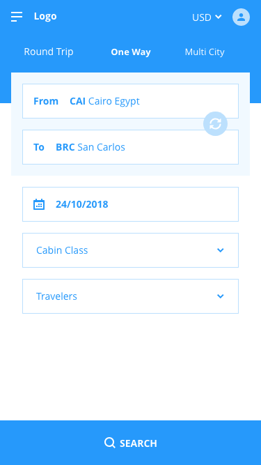
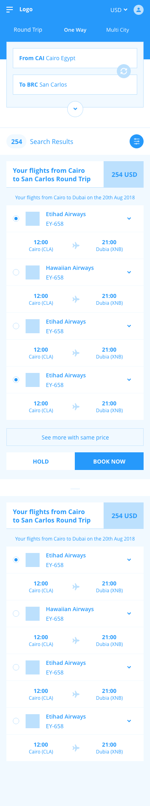

## Challenge Idea
The main idea of this task is to build a sample mobile version of our website flight search implementation, This will require you to build a mobile app (for sure :D ) which connect to our restful API and display search results to users.

## API Documentation

 Please find API documentation here https://docs.fly365.com/ , You can use stage or live environment, 
## API Key   
 guMRjevTJNNgv49LRTNCTzfp9cWnW6Sj

## Acceptance Criteria
- The application starts with displaying flight search form that matching the one on our website (https://nz.fly365.com/)
- Search form should have all fields as on our website and allow same core functionality
- After search, User should be able to filter search results by Airline, Airport, Flight stops
- Only main flow functionality is require, Which are: search form page , search result page
- We don't require specific UI implementation, Even though we expecting UI to be user friendly
- At least, Basic flight details should be displayed, this includes Airline name, origin airport, Destination Airport, Time, Price, Flight number.
- We expect you to handle all non 200 API response cases, this includes validation errors, 500 errors, etc

## Expectations

- We expecting this task to be completed using Swift language (version 4 or 5) for IOS Developers and Kotlin (1.3.0 at least) for Android Developers
- You are free to use any libraries, tools, frameworks which can help you accomplish the task
- We are expecting this task to be completed within one week maximum and to be send back by email
- We are expecting you to create a github public repo with the app code base
- README.md file should be included on your github repo and declare enough information about your application tech stack, codding /UI design decisions,How to run your app, any notes

We are looking for **readability, documentation, good architectural decisions, eye for performance, modularity, and unit tested code.**

 

